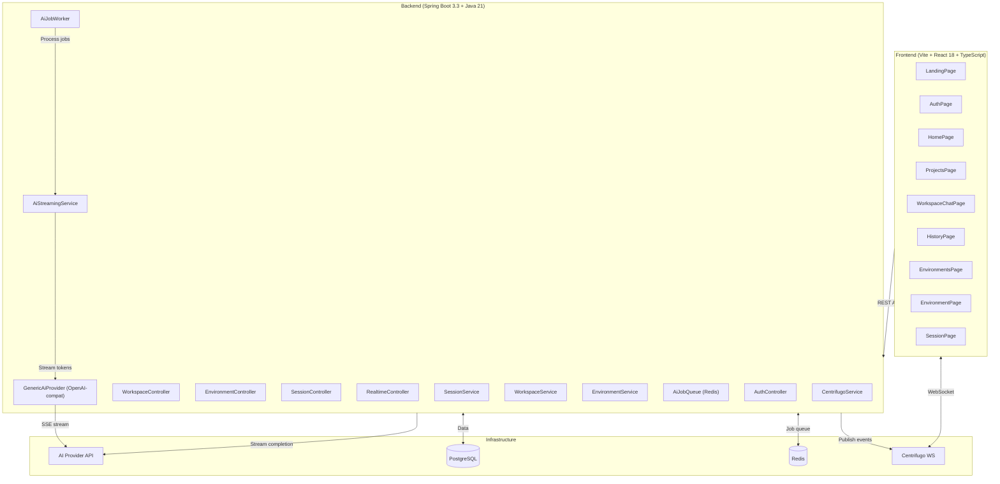
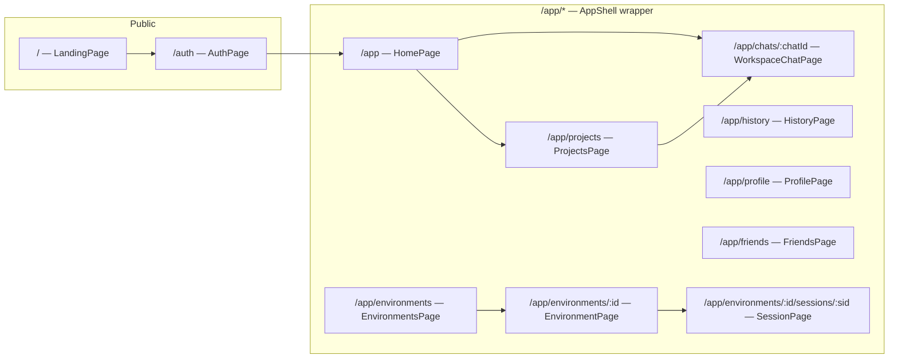
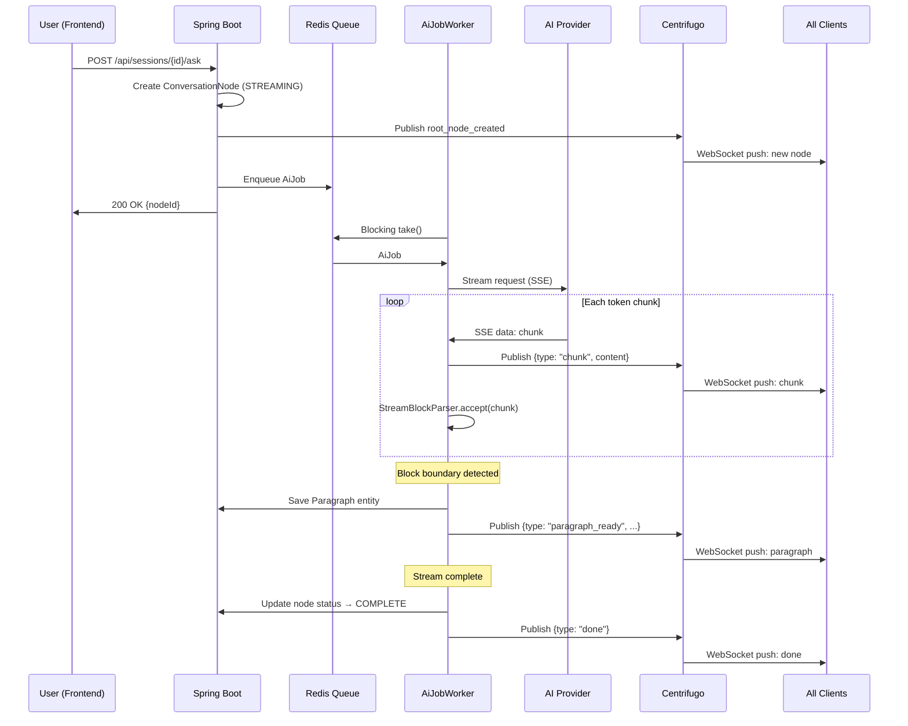

# SangamAI — Full Project Analysis

> **Tagline**: *"Slack for AI — collaborate with friends on projects over the same AI chat and shared context."*

---

## High-Level Architecture



---

## Technology Stack

### Backend
| Layer | Technology | Purpose |
|-------|-----------|---------|
| Framework | Spring Boot 3.3.4 + Java 21 | Core application framework |
| Security | Spring Security + JJWT 0.12.6 | JWT-based authentication |
| Database | PostgreSQL + Spring Data JPA + Hibernate | Persistent storage + ORM |
| Migrations | Flyway (11 migrations: V1–V11) | Schema versioning |
| Cache/Queue | Redis + Redisson | Snapshot caching + distributed job queue |
| Realtime | Centrifugo (via HTTP API) | WebSocket pub/sub fan-out |
| AI | Generic OpenAI-compatible provider | Streaming LLM completions |
| HTTP Client | Spring WebFlux (WebClient) | Non-blocking AI API + Centrifugo calls |
| Utilities | Lombok | Boilerplate reduction |

### Frontend
| Layer | Technology | Purpose |
|-------|-----------|---------|
| Build | Vite 6.2 + TypeScript 5.7 | Dev server + bundling |
| UI | React 18.3 | Component framework |
| Routing | React Router DOM 7.4 | Client-side routing |
| Markdown | react-markdown 10.1 + remark-gfm | AI response rendering |
| Syntax | PrismJS 1.30 (14 languages) | Code highlighting |
| Realtime | Centrifuge client 5.2 | WebSocket subscriptions |
| Styling | Vanilla CSS (~57KB single `styles.css`) | Dark/light theme system |

---

## Backend Package Structure

```
com.sangam.ai/
├── SangamAiApplication.java          # Entry point
├── ai/                               # AI integration layer
│   ├── AiMessage.java                # role + content record
│   ├── AiProvider.java               # Interface: streamResponse(messages) → Flux<String>
│   └── GenericAiProvider.java        # OpenAI-compat SSE streaming implementation
├── auth/                             # Authentication
│   ├── AuthController.java           # POST /api/auth/register, /api/auth/login
│   ├── AuthService.java              # Register/login logic, password hashing
│   ├── JwtAuthFilter.java            # Spring Security filter chain
│   ├── JwtService.java               # Token generation + validation
│   └── dto/                          # Request/response DTOs
├── common/
│   ├── exception/                    # Global exception handling
│   └── response/                     # ApiResponse wrapper
├── config/
│   ├── CorsConfig.java               # CORS policy
│   ├── RedisConfig.java              # Redis serialization config
│   ├── RedissonConfig.java           # Redisson client config
│   ├── SecurityConfig.java           # Spring Security filter chain
│   └── WebClientConfig.java          # Centrifugo WebClient bean
├── environment/                      # Collaborative rooms
│   ├── Environment.java              # JPA entity (name, description, inviteCode, host)
│   ├── EnvironmentController.java    # CRUD + join + member management endpoints
│   ├── EnvironmentMember.java        # JPA entity (role: OWNER/CO_HOST/MEMBER, canInteractWithAi)
│   ├── EnvironmentService.java       # Business logic (create, join, roles, permissions)
│   └── dto/                          # Request/response DTOs
├── realtime/                         # Centrifugo integration
│   ├── CentrifugoService.java        # Fire-and-forget publish to channels
│   ├── CentrifugoTokenService.java   # HMAC-SHA256 token generation
│   └── RealtimeController.java       # Token endpoints for frontend
├── session/                          # AI conversation sessions
│   ├── Session.java                  # JPA entity (environment, title, status: OPEN)
│   ├── ConversationNode.java         # JPA entity (tree node: parent, depth, question, fullContent, status)
│   ├── Paragraph.java                # JPA entity (node, index, content)
│   ├── SessionController.java        # REST: create session, ask root, ask on paragraph, get snapshot
│   ├── SessionService.java           # Core logic: ask, askOnParagraph, getSnapshot, permission checks
│   ├── AiStreamingService.java       # Stream AI response → save paragraphs → publish via Centrifugo
│   ├── AiJob.java                    # Job record (ROOT or PARAGRAPH type)
│   ├── AiJobQueue.java               # Redisson RBlockingQueue wrapper
│   ├── AiJobWorker.java              # Background worker thread (blocking take loop)
│   ├── SnapshotCacheService.java     # Redis-backed snapshot cache (invalidated during streaming)
│   ├── SessionStatusConverter.java   # JPA enum converter
│   ├── ConversationNodeStatusConverter.java
│   └── dto/                          # DTOs (SessionSnapshotDto, ConversationNodeDto, ParagraphDto, etc.)
├── user/
│   ├── User.java                     # JPA entity (username, email, password, displayName)
│   ├── UserController.java           # GET /api/users/me
│   └── UserRepository.java
└── workspace/                        # Personal AI workspace
    ├── Project.java                  # JPA entity (owner, name, systemInstructions, knowledgeContext)
    ├── SoloChat.java                 # JPA entity (owner, project, title, pinned)
    ├── SoloChatMessage.java          # JPA entity (chat, role, status, content)
    ├── WorkspaceController.java      # CRUD for projects + solo chats + send message
    ├── WorkspaceService.java         # Business logic + synchronous AI reply (blocking collect)
    └── dto/                          # Request/response DTOs
```

---

## Frontend Page Map



---

## Two Distinct AI Interaction Models

### 1. Personal Workspace (Solo Chat) — Synchronous
- **Flow**: User sends message → `WorkspaceService.sendMessage()` → calls `aiProvider.streamResponse().collectList().block()` → waits for full response → saves both user + assistant messages → returns updated chat
- **No realtime**: Response is collected as a whole string server-side, no streaming to the frontend
- **Project context**: Chats can optionally belong to a Project which injects `systemInstructions` + `knowledgeContext` into the system prompt

### 2. Environment Sessions (Collaborative) — Fully Streaming
- **Flow**: User asks question → `SessionService.ask()` → creates a `ConversationNode` in STREAMING status → publishes `root_node_created` event via Centrifugo → enqueues `AiJob` to Redis queue → returns immediately with `nodeId`
- **Worker picks up job**: `AiJobWorker` (blocking thread) takes from Redis queue → `AiStreamingService.process()` builds context messages → `aiProvider.streamResponse()` returns a `Flux<String>`
- **Streaming pipeline**: Each token chunk → published to `node:{id}:stream` Centrifugo channel → `StreamBlockParser` accumulates text and detects logical block boundaries (headings, code fences, lists, quotes, text paragraphs) → completed blocks saved as `Paragraph` entities → `paragraph_ready` event published → on stream complete, node marked `COMPLETE` + snapshot cache invalidated

### Paragraph Threading (Nested Conversations)
- Each AI response is split into paragraphs server-side by `StreamBlockParser`
- Users can click any paragraph to drill into it and ask follow-up questions (up to `MAX_DEPTH = 3`)
- This creates child `ConversationNode`s linked to a specific `paragraphId` on the parent node
- The frontend uses a **view stack** pattern with breadcrumb navigation rather than showing nested threads inline
- Three view types: `root` (main chat), `paragraph` (showing discussions on a specific paragraph), `node` (viewing a specific child answer)

---

## Realtime Event Flow



---

## Database Schema (11 Flyway Migrations)

| Migration | Table/Change |
|-----------|-------------|
| V1 | `users` (id, username, email, password_hash, display_name, timestamps) |
| V2 | `environments` (id, name, description, invite_code, host_id FK→users) |
| V3 | `environment_members` (id, environment_id, user_id, role, can_interact_with_ai) |
| V4 | `sessions` (id, environment_id, title, status, created_by FK→users) |
| V5 | `conversation_nodes` (id, session_id, parent_id self-FK, paragraph_id, depth, question, asked_by, full_content, status) |
| V6 | `paragraphs` (id, node_id FK→conversation_nodes, index, content) |
| V7 | Owner and co-host role adjustments |
| V8 | `projects` (id, owner_id, name, description, system_instructions, knowledge_context) |
| V9 | `solo_chats` (id, owner_id, project_id FK→projects, title) |
| V10 | `solo_chat_messages` (id, chat_id, role, status, content) |
| V11 | Add `pinned` column to `solo_chats` |

---

## Key Components Deep Dive

### `StreamBlockParser` (Backend)
A sophisticated state machine that segments streaming AI text into logical paragraphs:
- Detects **code fences** (``` blocks), **headings** (# lines), **lists** (- or 1.), **blockquotes** (>), and **text** blocks
- Merges short introductory text with the following code/list/quote block
- Merges headings with their body paragraph
- Operates character-by-character as tokens arrive, emitting completed blocks as soon as boundaries are confirmed

### `GenericAiProvider` (Backend)
A provider-agnostic AI client that works with any OpenAI-compatible API:
- Currently configured for **Groq** (llama-3.3-70b-versatile)
- Commented-out configs for OpenAI, Google Gemini, Together AI, Mistral
- Handles both SSE streaming and non-streaming fallback responses
- Robust SSE line parsing with buffered drain logic

### `SessionPage` (Frontend — 1058 lines, largest file)
The most complex UI component, handling:
- View stack navigation (root → paragraph → node) with breadcrumb
- Real-time Centrifugo subscriptions for session events and per-node streams
- Optimistic UI updates (inserting streaming nodes before server confirms)
- Snapshot polling (1.2s visible, 2.5s background) + full snapshot reconciliation
- Markdown rendering with Prism syntax highlighting (14 languages)
- Permission-aware composer (owner/co-host for root, AI-permission for paragraphs)

### `AppShell` (Frontend)
Collapsible sidebar with:
- Navigation: Home, Projects, History, Environments
- Recent chats list with overflow menu (pin, rename, move to project, delete)
- Theme toggle (dark/light with localStorage persistence)
- Profile chip + logout

---

## Current AI Provider Configuration

```properties
app.ai.base-url=https://api.groq.com/openai
app.ai.model=llama-3.3-70b-versatile
```

> [!WARNING]
> The **Groq API key is hardcoded** in `application.properties` (line 109). This should be moved to an environment variable `${AI_API_KEY}` before any public commit. There's also a **commented-out Gemini API key** on line 105.

---

## Key Observations & Changes Since Last Session

### What's New/Changed
1. **Nested paragraph chat is fully implemented** — the view stack pattern with breadcrumb navigation replaces the previous thread-in-sidebar approach
2. **StreamBlockParser** is a substantial new backend component (~260 lines) for intelligent paragraph splitting during streaming
3. **Snapshot caching** with Redis has been added — snapshots skip cache when any node is still STREAMING for fresh data
4. **Snapshot polling** alongside WebSocket events provides resilience — even if a Centrifugo event is missed, the next poll catches up
5. **Two-model AI pattern**: Solo chats use blocking/synchronous AI, environment sessions use fully async streaming through Redis job queue
6. **ChatOverflowMenu** is a polished component with rename, pin, delete, and move-to-project dialogs
7. **Starfield** canvas animation component exists but appears unused in the current page tree (likely for the landing page background but not imported)

### Architecture Strengths
- **Clean separation**: Environment (collaboration) vs Workspace (personal) are completely separate domains
- **Provider-agnostic AI**: Switching LLMs requires only 3 config lines
- **Resilient streaming**: Centrifugo for real-time + polling for catch-up + optimistic UI for responsiveness
- **Permission model**: Owner → Co-Host → Member hierarchy with granular `canInteractWithAi` toggle

### Potential Concerns
- **`styles.css` at 57KB** is a single monolithic file — could benefit from splitting by feature/page
- **Solo chat has no streaming UX** — the response blocks until the full AI reply is collected, which can feel slow for long responses
- **No error retry logic** in `AiJobWorker` — if a job fails, the node stays in STREAMING status forever
- **Hardcoded API keys** in `application.properties`
- **`Starfield.tsx`** and **`DashboardPanels.tsx`** appear to be unused/stub components
- **`FriendsPage.tsx`** (473 bytes) and **`ProfilePage.tsx`** (979 bytes) appear to be placeholder stubs

---

## File Size Summary

| File | Lines | Size |
|------|-------|------|
| `styles.css` | ~2000+ | 57.6 KB |
| `SessionPage.tsx` | 1058 | 36.7 KB |
| `AiStreamingService.java` | 477 | 18.5 KB |
| `EnvironmentService.java` | 284 | 11.7 KB |
| `SessionService.java` | 266 | 10.8 KB |
| `WorkspaceService.java` | 262 | 10.0 KB |
| `EnvironmentPage.tsx` | 287 | 9.2 KB |
| `pom.xml` | 258 | 8.7 KB |
| `ChatOverflowMenu.tsx` | 312 | 8.4 KB |
| `GenericAiProvider.java` | 228 | 8.4 KB |
| `WorkspaceChatPage.tsx` | 235 | 7.9 KB |
| `api.ts` | 335 | 7.3 KB |
| `AppShell.tsx` | 221 | 7.2 KB |
| `ProjectsPage.tsx` | 212 | 7.3 KB |
